# Modelagem do Banco de Dados - Cash-Me API

Este documento especifica a modelagem relacional do banco de dados PostgreSQL para o sistema **Cash-Me**, refletindo fielmente as migrações (**Lucid Migrations**) implementadas no diretório `database/migrations/`, atendendo às **Regras de Negócio (RN01 a RN08)**, **Arquitetura Orientada a Eventos (ADR-001)**, **Isolamento Lógico Multi-Tenant (ADR-002)** e às **Tasks (#1 a #9)**.

---

## 1. Diagrama de Entidade e Relacionamento (ERD)

```mermaid
erDiagram
    USERS ||--o| USER_ESTABLISHMENTS : "possui perfil lojista (1:1)"
    USERS ||--o| USER_CUSTOMERS : "possui perfil consumidor (1:1)"
    USERS ||--o{ AUTH_ACCESS_TOKENS : "possui tokens de autenticação"
    USERS ||--o{ POINT_RULES : "criou regras (created_by)"

    ESTABLISHMENTS ||--o| ESTABLISHMENT_ADDRESSES : "possui endereço físico (1:1)"
    ESTABLISHMENTS ||--o{ USER_ESTABLISHMENTS : "possui colaboradores (equipe)"
    ESTABLISHMENTS ||--o{ INVOICES : "emite notas fiscais"
    ESTABLISHMENTS ||--o{ POINT_BALANCES : "mantém saldos dos clientes"
    ESTABLISHMENTS ||--o{ POINT_TRANSACTIONS : "gera extrato de transações de pontos"
    ESTABLISHMENTS ||--o| LOYALTY_PROGRAMS : "possui programa de fidelidade (1:1)"
    ESTABLISHMENTS ||--o{ POINT_RULES : "possui regras de pontuação"
    
    USER_CUSTOMERS ||--o{ INVOICES : "escaneia notas fiscais"
    USER_CUSTOMERS ||--o{ POINT_BALANCES : "acumula pontos por lojista"
    USER_CUSTOMERS ||--o{ POINT_TRANSACTIONS : "histórico transacional"
    
    INVOICES ||--o{ INVOICE_ITEMS : "contém itens"
    INVOICES ||--o| POINT_TRANSACTIONS : "origina crédito"

    LOYALTY_PROGRAMS ||--o{ POINT_RULES : "contém regras versionadas"
    POINT_RULES ||--o{ POINT_TRANSACTIONS : "referenciada na transação"

    ESTABLISHMENTS {
        increments id PK
        string cnpj UK "14 dígitos limpos"
        string legal_name "Razão Social"
        string trade_name "Nome Fantasia (Vitrine)"
        string status "PENDING | ACTIVE | INACTIVE"
        decimal conversion_factor "Default 1.0000"
        string phone "Nullable (Telefone fixo)"
        string whatsapp "Nullable (WhatsApp comercial)"
        string email "Nullable (E-mail comercial)"
        string website "Nullable (Site institucional)"
        string instagram "Nullable (@perfil ou URL)"
        jsonb social_links "Nullable (Redes adicionais)"
        timestamp created_at
        timestamp updated_at "Nullable"
    }

    ESTABLISHMENT_ADDRESSES {
        increments id PK
        integer establishment_id FK "UNIQUE -> establishments.id"
        string postal_code "CEP 8 dígitos limpos"
        string state "UF 2 chars (SC, PR, etc.)"
        string city "Cidade"
        string neighborhood "Bairro"
        string street "Logradouro/Rua"
        string number "Número ou S/N"
        string complement "Nullable (Complemento)"
        string reference "Nullable (Ponto de referência)"
        decimal latitude "Nullable (10,8 - Local Discovery)"
        decimal longitude "Nullable (11,8 - Local Discovery)"
        timestamp created_at
        timestamp updated_at "Nullable"
    }

    USERS {
        increments id PK
        string email UK
        string password "Hash seguro"
        string user_type "CUSTOMER | ESTABLISHMENT | SUPER_ADMIN"
        string status "ACTIVE | INACTIVE | BLOCKED"
        timestamp last_login_at "Nullable"
        timestamp created_at
        timestamp updated_at "Nullable"
    }

    AUTH_ACCESS_TOKENS {
        increments id PK
        integer tokenable_id FK "FK -> users.id"
        string type
        string name "Nullable"
        string hash
        text abilities
        timestamp last_used_at "Nullable"
        timestamp expires_at "Nullable"
        timestamp created_at
        timestamp updated_at
    }

    USER_ESTABLISHMENTS {
        increments id PK
        integer user_id FK "UNIQUE -> users.id"
        integer establishment_id FK "Nullable -> establishments.id"
        string full_name
        string role "LOJISTA_ADMIN | LOJISTA_OPERADOR | SUPER_ADMIN"
        timestamp created_at
        timestamp updated_at "Nullable"
    }

    USER_CUSTOMERS {
        increments id PK
        integer user_id FK "UNIQUE -> users.id"
        string full_name
        string cpf UK "Nullable (11 dígitos)"
        string phone "Nullable (20 chars)"
        string auth_provider "LOCAL | GOOGLE | APPLE"
        string social_id "Nullable"
        timestamp terms_accepted_at "Nullable (RN08 / Termos Globais)"
        string device_token "Nullable (FCM Push Token)"
        timestamp created_at
        timestamp updated_at "Nullable"
    }

    INVOICES {
        increments id PK
        integer customer_id FK "FK -> user_customers.id"
        integer establishment_id FK "Nullable -> establishments.id"
        string access_key UK "44 dígitos SEFAZ (Anti-fraude)"
        text qr_code_url
        string issuer_state "SC | PR (2 chars)"
        string issuer_cnpj "14 dígitos"
        timestamp issued_at "Data emissão nota (RN01: máx 48h)"
        decimal total_amount "Valor total da nota (10,2)"
        decimal points_awarded "Pontos concedidos (10,2)"
        string status "PENDING | PROCESSING | PROCESSED | REJECTED | ERROR_SCRAPING"
        text rejection_reason "Nullable"
        timestamp created_at
        timestamp updated_at "Nullable"
    }

    INVOICE_ITEMS {
        increments id PK
        integer invoice_id FK "FK -> invoices.id"
        string raw_description "Descrição bruta do produto"
        decimal quantity "Quantidade (10,3)"
        decimal unit_price "Valor unitário (10,2)"
        decimal total_price "Valor total (10,2)"
        timestamp created_at
    }

    POINT_BALANCES {
        increments id PK
        integer customer_id FK "FK -> user_customers.id"
        integer establishment_id FK "FK -> establishments.id"
        decimal current_balance "Saldo disponível (10,2)"
        decimal total_accumulated "Total acumulado histórico (10,2)"
        timestamp created_at
        timestamp updated_at "Nullable"
    }

    POINT_TRANSACTIONS {
        increments id PK
        integer customer_id FK "FK -> user_customers.id"
        integer establishment_id FK "FK -> establishments.id"
        integer invoice_id FK "Nullable -> invoices.id"
        integer rule_id FK "Nullable -> point_rules.id"
        integer rule_version "Nullable"
        string type "CREDIT | DEBIT | REVERSAL"
        decimal points "Pontos movimentados (10,2)"
        decimal purchase_amount "Nullable (10,2)"
        decimal applied_conversion_factor "Nullable (10,4)"
        string description
        jsonb metadata "Nullable"
        timestamp created_at
    }

    LOYALTY_PROGRAMS {
        increments id PK
        integer establishment_id FK "UNIQUE -> establishments.id"
        string name "Default: Programa de Fidelidade"
        string status "ACTIVE | INACTIVE"
        string points_currency "Default: pontos"
        timestamp created_at
        timestamp updated_at "Nullable"
    }

    POINT_RULES {
        increments id PK
        integer loyalty_program_id FK "FK -> loyalty_programs.id"
        integer establishment_id FK "FK -> establishments.id"
        integer created_by FK "Nullable -> users.id"
        integer version "Default: 1"
        string name
        string status "ACTIVE | INACTIVE"
        decimal base_amount "Default: 1.00 (10,2)"
        integer points_per_base "Default: 1"
        decimal min_purchase_amount "Default: 0.00 (10,2)"
        integer max_points_per_purchase "Nullable"
        timestamp created_at
        timestamp updated_at "Nullable"
    }
```

---

### 2.1 `establishments` (Tenants / Lojistas / Vitrine)
Representa as empresas parceiras do ecossistema e atua como a entidade central do lojista e sua vitrine.
- `id` (PK, Increments)
- `cnpj` (VARCHAR(14), UNIQUE, NOT NULL): CNPJ limpo sem formatação. Índice único para vínculo rápido com NFC-e (RN03).
- `legal_name` (VARCHAR(255), NOT NULL): Razão Social da empresa.
- `trade_name` (VARCHAR(255), NOT NULL): Nome Fantasia da empresa exibido na vitrine do app.
- `status` (VARCHAR(20), NOT NULL, DEFAULT `'PENDING'`): Status do cadastro (`'PENDING'`, `'ACTIVE'`, `'INACTIVE'`). Novas contas iniciam como `'PENDING'` (RN06). Se `'INACTIVE'`, novas pontuações de NFC-e são bloqueadas (RN05).
- `conversion_factor` (DECIMAL(10,4), NOT NULL, DEFAULT `1.0000`): Fator base de conversão monetária para pontos (ex: R$ 1,00 = 1 ponto -> `1.0000`).

#### 📞 Contato & Redes Sociais
Canais de atendimento e engajamento disponibilizados ao consumidor na vitrine:
- `phone` (VARCHAR(20), NULLABLE): Telefone comercial fixo.
- `whatsapp` (VARCHAR(20), NULLABLE): WhatsApp comercial para atendimento direto e dúvidas.
- `email` (VARCHAR(254), NULLABLE): E-mail de contato público do comércio (independente do e-mail de login dos administradores).
- `website` (VARCHAR(255), NULLABLE): URL do site oficial do estabelecimento.
- `instagram` (VARCHAR(100), NULLABLE): Nome de usuário (ex: `@lojadomanoel`) ou link do perfil no Instagram.
- `social_links` (JSONB, NULLABLE): Objeto flexível para outros links sociais (ex: `{"facebook": "...", "tiktok": "..."}`).

#### ⏱️ Metadados
- `created_at` (TIMESTAMPTZ, NOT NULL)
- `updated_at` (TIMESTAMPTZ, NULLABLE)

---

### 2.2 `establishment_addresses` (Endereço Físico & Local Discovery)
Entidade dedicada para isolar os atributos de localização física do comércio, viabilizando busca local e vitrine por proximidade (Local Discovery).
- `id` (PK, Increments)
- `establishment_id` (INTEGER UNSIGNED, UNIQUE, NOT NULL, FK -> `establishments.id` ON DELETE CASCADE): Vínculo 1:1 com o estabelecimento parceiro.
- `postal_code` (VARCHAR(8), NOT NULL): CEP sem máscara (8 dígitos numéricos). Permite preenchimento automático via busca de CEP.
- `state` (VARCHAR(2), NOT NULL): Sigla da Unidade Federativa (ex: `'SC'`, `'PR'`).
- `city` (VARCHAR(100), NOT NULL): Município sede da loja.
- `neighborhood` (VARCHAR(100), NOT NULL): Bairro.
- `street` (VARCHAR(255), NOT NULL): Logradouro (Rua, Avenida, Praça, etc.).
- `number` (VARCHAR(20), NOT NULL): Número predial ou 'S/N'.
- `complement` (VARCHAR(100), NULLABLE): Complemento opcional (loja, sala, andar, bloco).
- `reference` (VARCHAR(255), NULLABLE): Ponto de referência opcional para orientar o consumidor (ex: "Em frente ao posto Shell").
- `latitude` (DECIMAL(10, 8), NULLABLE): Coordenada geográfica para busca por proximidade / pin no mapa da vitrine.
- `longitude` (DECIMAL(11, 8), NULLABLE): Coordenada geográfica para busca por proximidade / pin no mapa da vitrine.
- `created_at` (TIMESTAMPTZ, NOT NULL)
- `updated_at` (TIMESTAMPTZ, NULLABLE)

---

### 2.3 `users` (Tabela Central de Credenciais e Identidade AdonisJS)
Entidade de identidade única utilizada pelo sistema de autenticação nativo do AdonisJS (`@adonisjs/auth`).
- `id` (PK, Increments)
- `email` (VARCHAR(254), UNIQUE, NOT NULL): E-mail de login unificado.
- `password` (VARCHAR(255), NOT NULL): Hash de senha gerenciado pelo AdonisJS Hash Service.
- `user_type` (VARCHAR(30), NOT NULL, DEFAULT `'CUSTOMER'`): Tipo do usuário (`'CUSTOMER'`, `'ESTABLISHMENT'`, `'SUPER_ADMIN'`).
- `status` (VARCHAR(20), NOT NULL, DEFAULT `'ACTIVE'`): (`'ACTIVE'`, `'INACTIVE'`, `'BLOCKED'`).
- `last_login_at` (TIMESTAMPTZ, NULLABLE): Data/hora do último acesso realizado.
- `created_at` (TIMESTAMPTZ, NOT NULL)
- `updated_at` (TIMESTAMPTZ, NULLABLE)

### 2.3 `auth_access_tokens` (Tokens de Acesso da API)
Tabela gerenciada pelo `@adonisjs/auth` (DbAccessTokensProvider) para tokens OAT (Bearer tokens).
- `id` (PK, Increments)
- `tokenable_id` (INTEGER UNSIGNED, NOT NULL, FK -> `users.id` ON DELETE CASCADE)
- `type` (VARCHAR(255), NOT NULL)
- `name` (VARCHAR(255), NULLABLE)
- `hash` (VARCHAR(255), NOT NULL)
- `abilities` (TEXT, NOT NULL)
- `last_used_at` (TIMESTAMPTZ, NULLABLE)
- `expires_at` (TIMESTAMPTZ, NULLABLE)
- `created_at` (TIMESTAMPTZ)
- `updated_at` (TIMESTAMPTZ)

### 2.4 `user_establishments` (Perfil de Usuários do Painel Lojista / Admin)
Perfil associado a usuários corporativos vinculados a um estabelecimento ou super-administradores.
- `id` (PK, Increments)
- `user_id` (INTEGER UNSIGNED, UNIQUE, NOT NULL, FK -> `users.id` ON DELETE CASCADE): Chave estrangeira 1:1 com `users`.
- `establishment_id` (INTEGER UNSIGNED, NULLABLE, FK -> `establishments.id` ON DELETE SET NULL): `NULL` para administradores globais (`SUPER_ADMIN`). Preenchido para lojistas.
- `full_name` (VARCHAR(255), NOT NULL): Nome completo do colaborador/responsável.
- `role` (VARCHAR(50), NOT NULL, DEFAULT `'LOJISTA_ADMIN'`): Papel de permissão (`'LOJISTA_ADMIN'`, `'LOJISTA_OPERADOR'`, `'SUPER_ADMIN'`).
- `created_at` (TIMESTAMPTZ, NOT NULL)
- `updated_at` (TIMESTAMPTZ, NULLABLE)

### 2.5 `user_customers` (Perfil de Conta Global do Consumidor Mobile)
Perfil do cliente final no aplicativo móvel (Glossário: Conta Global / Task #2).
- `id` (PK, Increments)
- `user_id` (INTEGER UNSIGNED, UNIQUE, NOT NULL, FK -> `users.id` ON DELETE CASCADE): Chave estrangeira 1:1 com `users`.
- `full_name` (VARCHAR(255), NOT NULL): Nome completo do consumidor.
- `cpf` (VARCHAR(11), UNIQUE, NULLABLE): CPF desformatado (11 dígitos).
- `phone` (VARCHAR(20), NULLABLE): Telefone/WhatsApp do cliente.
- `auth_provider` (VARCHAR(50), NOT NULL, DEFAULT `'LOCAL'`): Provedor de autenticação (`'LOCAL'`, `'GOOGLE'`, `'APPLE'`).
- `social_id` (VARCHAR(255), NULLABLE): ID retornado pelo provedor OAuth social.
- `terms_accepted_at` (TIMESTAMPTZ, NULLABLE): Data/hora do aceite dos Termos Globais (RN08).
- `device_token` (VARCHAR(255), NULLABLE): Token FCM para notificações push (Task #9).
- `created_at` (TIMESTAMPTZ, NOT NULL)
- `updated_at` (TIMESTAMPTZ, NULLABLE)

### 2.6 `invoices` (Notas Fiscais Processadas / NFC-e)
Armazena as tentativas, metadados fiscais e resultado da leitura da NFC-e (Tasks #3 e #4).
- `id` (PK, Increments)
- `customer_id` (INTEGER UNSIGNED, NOT NULL, FK -> `user_customers.id` ON DELETE CASCADE): Consumidor que submeteu o QR Code.
- `establishment_id` (INTEGER UNSIGNED, NULLABLE, FK -> `establishments.id` ON DELETE SET NULL): Vinculado após o match do CNPJ emitente.
- `access_key` (VARCHAR(44), UNIQUE, NOT NULL): Chave de acesso de 44 dígitos da SEFAZ (RN02 - Anti-Fraude).
- `qr_code_url` (TEXT, NOT NULL): URL original do QR Code escaneado.
- `issuer_state` (VARCHAR(2), NOT NULL): UF emitente (`'SC'` ou `'PR'`) (RN07).
- `issuer_cnpj` (VARCHAR(14), NOT NULL): CNPJ de 14 dígitos extraído do QR Code ou Scraping.
- `issued_at` (TIMESTAMPTZ, NOT NULL): Timestamp de emissão da nota fiscal pela SEFAZ (RN01: máximo 48h).
- `total_amount` (DECIMAL(10,2), NOT NULL): Valor total da compra.
- `points_awarded` (DECIMAL(10,2), NOT NULL, DEFAULT `0.00`): Quantidade de pontos concedida ao consumidor.
- `status` (VARCHAR(30), NOT NULL, DEFAULT `'PENDING'`): Status do fluxo (`'PENDING'`, `'PROCESSING'`, `'PROCESSED'`, `'REJECTED'`, `'ERROR_SCRAPING'`).
- `rejection_reason` (TEXT, NULLABLE): Motivo detalhado caso a nota seja rejeitada (ex: `'EXPIRADO_48H'`, `'FORA_ESTADO_ALVO'`, `'LOJISTA_INATIVO'`, `'CHAVE_DUPLICADA'`).
- `created_at` (TIMESTAMPTZ, NOT NULL)
- `updated_at` (TIMESTAMPTZ, NULLABLE)

### 2.7 `invoice_items` (Itens Extraídos da Nota Fiscal)
Itens individuais de produtos extraídos da NFC-e durante o scraping da SEFAZ.
- `id` (PK, Increments)
- `invoice_id` (INTEGER UNSIGNED, NOT NULL, FK -> `invoices.id` ON DELETE CASCADE)
- `raw_description` (VARCHAR(255), NOT NULL): Descrição bruta do produto impresso na nota (Glossário).
- `quantity` (DECIMAL(10,3), NOT NULL): Quantidade adquirida.
- `unit_price` (DECIMAL(10,2), NOT NULL): Valor unitário do item.
- `total_price` (DECIMAL(10,2), NOT NULL): Valor total do item.
- `created_at` (TIMESTAMPTZ, NOT NULL)

### 2.8 `point_balances` (Saldo Consolidado Multi-Tenant por Estabelecimento)
Armazena o saldo atual e o histórico acumulado de um consumidor em cada lojista (ADR-002, RN05 e RN08).
- `id` (PK, Increments)
- `customer_id` (INTEGER UNSIGNED, NOT NULL, FK -> `user_customers.id` ON DELETE CASCADE)
- `establishment_id` (INTEGER UNSIGNED, NOT NULL, FK -> `establishments.id` ON DELETE CASCADE)
- `current_balance` (DECIMAL(10,2), NOT NULL, DEFAULT `0.00`): Saldo de pontos disponível para resgate.
- `total_accumulated` (DECIMAL(10,2), NOT NULL, DEFAULT `0.00`): Histórico acumulado vitalício.
- `created_at` (TIMESTAMPTZ, NOT NULL)
- `updated_at` (TIMESTAMPTZ, NULLABLE)
- **Constraint Única:** `UNIQUE (customer_id, establishment_id)` — Garante exatamente 1 registro de saldo por cliente/tenant.

### 2.9 `point_transactions` (Extrato / Ledger Imutável de Pontos)
Log de auditoria e movimentações financeiras de fidelidade (Task #5 & RN05).
- `id` (PK, Increments)
- `customer_id` (INTEGER UNSIGNED, NOT NULL, FK -> `user_customers.id` ON DELETE CASCADE)
- `establishment_id` (INTEGER UNSIGNED, NOT NULL, FK -> `establishments.id` ON DELETE CASCADE)
- `invoice_id` (INTEGER UNSIGNED, NULLABLE, FK -> `invoices.id` ON DELETE SET NULL): Nota fiscal que gerou a movimentação.
- `rule_id` (INTEGER UNSIGNED, NULLABLE, FK -> `point_rules.id` ON DELETE SET NULL): Regra de fidelidade aplicada.
- `rule_version` (INTEGER, NULLABLE): Versão da regra no momento da transação.
- `type` (VARCHAR(20), NOT NULL): Tipo da transação (`'CREDIT'`, `'DEBIT'`, `'REVERSAL'`).
- `points` (DECIMAL(10,2), NOT NULL): Pontos creditados ou debitados.
- `purchase_amount` (DECIMAL(10,2), NULLABLE): Valor da compra que originou os pontos.
- `applied_conversion_factor` (DECIMAL(10,4), NULLABLE): Fator de conversão em vigor no cálculo.
- `description` (VARCHAR(255), NOT NULL): Descrição amigável para o extrato.
- `metadata` (JSONB, NULLABLE): Dados complementares do cálculo e parâmetros aplicados.
- `created_at` (TIMESTAMPTZ, NOT NULL)

### 2.10 `loyalty_programs` (Programa de Fidelidade do Estabelecimento)
Configuração do programa de fidelidade do tenant (Task #6).
- `id` (PK, Increments)
- `establishment_id` (INTEGER UNSIGNED, UNIQUE, NOT NULL, FK -> `establishments.id` ON DELETE CASCADE): Relação 1:1 com o estabelecimento.
- `name` (VARCHAR(255), NOT NULL, DEFAULT `'Programa de Fidelidade'`)
- `status` (VARCHAR(20), NOT NULL, DEFAULT `'ACTIVE'`)
- `points_currency` (VARCHAR(50), NOT NULL, DEFAULT `'pontos'`): Nome da moeda do programa (ex: pontos, créditos, estrelas).
- `created_at` (TIMESTAMPTZ, NOT NULL)
- `updated_at` (TIMESTAMPTZ, NULLABLE)

### 2.11 `point_rules` (Regras Versionadas de Pontuação do Lojista)
Regras de cálculo de pontos customizáveis pelo lojista com histórico de versionamento (Task #6 / RN04).
- `id` (PK, Increments)
- `loyalty_program_id` (INTEGER UNSIGNED, NOT NULL, FK -> `loyalty_programs.id` ON DELETE CASCADE)
- `establishment_id` (INTEGER UNSIGNED, NOT NULL, FK -> `establishments.id` ON DELETE CASCADE)
- `created_by` (INTEGER UNSIGNED, NULLABLE, FK -> `users.id` ON DELETE SET NULL): Usuário que criou a versão da regra.
- `version` (INTEGER, NOT NULL, DEFAULT `1`): Número sequencial da versão.
- `name` (VARCHAR(255), NOT NULL): Nome da regra (ex: "Regra Padrão R$1 = 1 Ponto").
- `status` (VARCHAR(20), NOT NULL, DEFAULT `'ACTIVE'`): Status da regra (`'ACTIVE'`, `'INACTIVE'`).
- `base_amount` (DECIMAL(10,2), NOT NULL, DEFAULT `1.00`): Valor monetário base para conversão.
- `points_per_base` (INTEGER, NOT NULL, DEFAULT `1`): Pontos gerados a cada valor base.
- `min_purchase_amount` (DECIMAL(10,2), NOT NULL, DEFAULT `0.00`): Valor mínimo de compra elegível para pontuar.
- `max_points_per_purchase` (INTEGER, NULLABLE): Teto máximo de pontos por compra (opcional).
- `created_at` (TIMESTAMPTZ, NOT NULL)
- `updated_at` (TIMESTAMPTZ, NULLABLE)
- **Constraint Única:** `UNIQUE (loyalty_program_id, version)` — Garante versionamento linear único por programa.

---

## 3. Mapeamento das Regras de Negócio e Tasks

| Código | Descrição da Regra / Task | Solução de Modelagem no Banco de Dados |
| :--- | :--- | :--- |
| **Task #1 & RN06** | Onboarding de Lojistas | `establishments.status` inicia em `'PENDING'`. Aprovado por rota super-admin para `'ACTIVE'`. |
| **Task #2** | Cadastro Global Consumidor | Tabela `user_customers` desacoplada de lojistas com `terms_accepted_at`. |
| **Task #3 & RN01 & RN02 & RN07** | QR Code, 48h, SC/PR, Anti-fraude | `invoices.access_key` com `UNIQUE INDEX`. `invoices.issued_at` e `issuer_state` validados. |
| **Task #4** | Scraping Assíncrono SEFAZ | Status da `invoices` (`PENDING` -> `PROCESSING` -> `PROCESSED`). Itens salvos em `invoice_items`. |
| **Task #5 & ADR-002** | Motor de Pontos & Multi-Tenant | `point_balances` e `point_transactions` isolados obrigatoriamente por `establishment_id` + `customer_id`. |
| **Task #6 & RN04** | Regras de Fidelidade Customizadas | `loyalty_programs` e `point_rules` versionadas por tenant. Transações registram `rule_id` e `applied_conversion_factor`. |
| **Task #7 & RN05** | Inadimplência e Manutenção de Saldo | Se `establishments.status = 'INACTIVE'`, novas `invoices` são rejeitadas (`rejection_reason = 'LOJISTA_INATIVO'`), mas `point_balances` é preservado. |
| **Task #8 & RN08** | Dashboard Lojista & Privacidade | Consultas do lojista filtram `user_customers` via `JOIN point_balances WHERE point_balances.establishment_id = :tenantId`. |
| **Task #9 & ADR-001** | Push Notification FCM | `user_customers.device_token` armazena o token para notificações via Firebase Cloud Messaging. |

---

## 4. Índices Criados nas Migrations para Performance

A integridade referencial e o isolamento multi-tenant são reforçados pelos seguintes índices criados via migrations:

1. **Unicidade de Identidades e Anti-Fraude:**
   - `users.email` (UNIQUE)
   - `user_establishments.user_id` (UNIQUE)
   - `user_customers.user_id` (UNIQUE)
   - `user_customers.cpf` (UNIQUE)
   - `establishments.cnpj` (UNIQUE)
   - `invoices.access_key` (UNIQUE)
2. **Isolamento Multi-Tenant e Índices Compostos:**
   - `point_balances`: `UNIQUE (customer_id, establishment_id)`
   - `point_balances`: `INDEX (establishment_id, customer_id)`
   - `point_transactions`: `INDEX (establishment_id, customer_id, created_at)`
   - `point_transactions`: `INDEX (customer_id, created_at)`
   - `invoices`: `INDEX (customer_id)`
   - `invoices`: `INDEX (establishment_id)`
   - `invoices`: `INDEX (status, created_at)`
   - `invoice_items`: `INDEX (invoice_id)`
   - `loyalty_programs`: `UNIQUE (establishment_id)`
   - `point_rules`: `UNIQUE (loyalty_program_id, version)`
   - `point_rules`: `INDEX (establishment_id, status)`
3. **Vitrine e Local Discovery (`establishment_addresses`):**
   - `establishment_addresses`: `UNIQUE (establishment_id)` — Relação 1:1 rigorosa por loja.
   - `establishment_addresses`: `INDEX (state, city)` — Otimiza buscas e listagens de lojistas por localização geográfica na vitrine.
   - `establishment_addresses`: `INDEX (latitude, longitude)` — Otimiza consultas por raio de proximidade (geolocalização).
